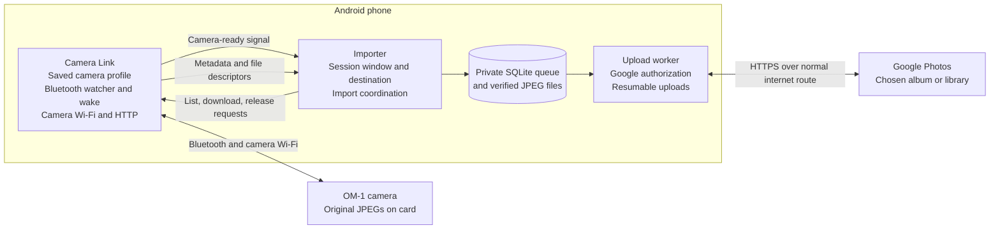

# How I understand OM-1 Importer

This document describes the intended experience from the hiking use case, the
current implementation, and the remaining differences between them. It reflects
the source and the latest phone tests in this conversation. Diagrams marked
“intended” describe the behavior we want, rather than a completed hardware test.

## The purpose

Before a hike, choose an album and the hours during which you will take photos.
Shoot normally. Whenever you turn the camera off during a break, the phone should
collect eligible photos. It should upload them when an allowed internet connection
is available. You should not need to start a new session because the camera went
out of range, either app restarted, or the phone rebooted.

If you forgot to create the session, you should be able to enter the hike's start
and end times afterward and collect the same photos from the camera into the
chosen album.

The target is original JPEGs from one saved camera, using one connected Google
account. RAW files and videos are outside the current import path. Camera originals
are never deleted by these apps.

## Three different things happen on three different schedules

| Concept | What it means | What should end it |
| --- | --- | --- |
| Session window | Which photos belong to the outing and where newly queued photos should go | The end time closes eligibility for later photos; outstanding eligible photos can still be collected |
| Camera import | One attempt to copy eligible JPEGs from camera to phone | Batch completion, interruption, or an explicit pause |
| Cloud upload | Delivery of verified phone copies to Google Photos | Confirmed creation in Google Photos, or a pause/error requiring retry |

A photo taken at 11:00 can belong to a 09:00–17:00 session even if the phone first
sees it at 18:00 and uploads it at 21:00. Losing the camera connection should only
interrupt the camera import. It should not erase the session or discard the queue.

The following is the intended sequence for that photo:


The implementation accepts the start boundary and excludes the end boundary:
`start <= photo time < end`. For a 09:00–17:00 window, a photo timestamped exactly
17:00 is excluded. The eight-hour value shown initially is an editable default.

## How I expect someone to use it

### One-time setup

1. Install matching builds of **OM-1 Importer** and **OM-1 Camera Link**.
2. In Camera Link, scan the camera's QR code to save Wi-Fi and Bluetooth details.
   Grant the nearby-device and notification permissions requested by the apps.
3. Enable the camera's smartphone Bluetooth standby and Power-off Standby settings.
   Check that a manual connection works before relying on an unattended outing.
4. Connect the Google account in Importer and load or create an app-created album.
   Local camera imports can also be made before Google setup; unassigned queued
   photos are assigned when an account is connected.
5. Choose whether cellular uploads and removal of confirmed phone copies are allowed.
   If a VPN prevents camera access, the two-app arrangement allows Camera Link to
   be excluded from the VPN separately from Importer.

### Before and during a hike

Choose the album before saving the session. Enter the start and end date/time in
the displayed camera-clock time zone using `YYYY-MM-DD HH:mm`, then select **Save session and watch
for power-off**. Saving the window must work even when the camera is unavailable.

During the hike, take pictures normally. Switch the camera off for a break. The
intended automatic path detects standby, establishes the connection, imports the
eligible photos, and releases camera Wi-Fi. After the transfer releases the link,
switch the camera back on to resume shooting. Prior hardware observations found
that the camera's smartphone connection mode can interfere with normal shooting,
so this is a between-shooting workflow.

**Sync this session now** is the manual recovery path. It opens Camera Link to
connect, then returns an explicit camera-ready signal to Importer for a batch.
This avoids depending on whether the importer was stopped while Camera Link was
visible; a fast connection previously left the import request waiting.
A saved session remains available
for this action after its end time.

### If the session was forgotten

For a hike yesterday from 09:00 to 17:00, select the destination album, enter
yesterday's date and that interval, and save it. Then use **Sync this session now**
with the camera available, or leave Camera Link watching for standby. A past window
now remains eligible for automatic collection until a complete scan after its end
time succeeds. The saved session remains available afterward for manual rescans.

This can only collect photos that are still accessible on the camera. It is not a
way to recover deleted camera files. Existing queue entries keep their original
destinations: recreating a window with another album does not currently move or
re-add previously imported photos to that album.

## Why there are two Android apps



Camera Link owns the camera connection and encrypted camera credentials. Importer
owns the session, Google account, durable photo queue, and cloud delivery. The
apps communicate through explicit, signature-protected Android interfaces.

This split lets the phone treat camera networking separately from internet/VPN
traffic. Importer does not obtain camera credentials or open camera HTTP sockets.
There is no hosted application backend between the phone and Google Photos.

## What happens when the camera becomes available

The current automatic path is:

```mermaid
sequenceDiagram
    actor Person
    participant I as Importer
    participant L as Camera Link
    participant C as Camera
    participant Q as Local queue
    Person->>I: Save start, end, and destination
    I->>Q: Persist session before connecting
    I->>L: Persist watcher start and end
    Note over L: Wait until start; watch until successful final collection
    Person->>C: Switch off during a break
    C-->>L: Bluetooth advertisement
    Note over L,C: Current trigger interprets controller-power bit as standby
    L->>C: Bluetooth wake/authentication; request camera Wi-Fi
    C-->>L: Wi-Fi available
    L-->>I: Camera-ready broadcast schedules Android import job
    I->>L: Enumerate camera directories and pages
    L-->>I: Camera identity, paths, sizes, timestamps
    I->>Q: Add eligible, previously unseen photos
    loop Pending camera photos
        I->>L: Download original JPEG
        L-->>I: File descriptor and integrity receipt
        I->>Q: Verify and save phone copy
    end
    I->>L: Release connection with session ID and scan acknowledgement
    Note over L: Resume unless a complete scan started after the end
    Note over I,Q: Schedule cloud upload even after a partial batch
```

The Bluetooth trigger deserves particular care. The code currently treats a
cleared controller-power bit in a recognized advertisement from the saved camera
as Power-off Standby. It does not directly read the physical switch, and it does
not require an observed ON-to-OFF transition. The protocol notes distinguish
controller power from transfer readiness. This interpretation still needs a
controlled switch-cycle test; it should not yet be described as proven physical
power-switch detection.

## How photos are selected and delivered

The session stores its unique ID, start, end, clock time zone, account, and selected
album in SQLite, and pins the camera identity on its first listing. Saving a
new session replaces the one selected session; there is no session history or
multi-session scheduler yet. That replacement does not erase already queued photos.

On discovery, the importer decodes the camera listing's packed FAT date/time words
and checks the result against the session window. The initial parser incorrectly
expected formatted date strings, causing valid camera photos to be silently
excluded; this was identified from the phone's saved camera metadata and corrected.
The encoding uses two-second resolution, following the
[FAT date/time layout](https://learn.microsoft.com/en-us/windows/win32/api/winbase/nf-winbase-filetimetodosdatetime).
It currently uses that listing timestamp as a proxy
for capture time, interpreted in the session's saved time zone (initially the
phone's zone). Changing the phone zone later does not change that interpretation.
It does not read EXIF capture time for selection or offer camera-clock calibration.
Unparseable or daylight-saving-ambiguous timestamps are excluded and reported;
they prevent a falsely successful final collection acknowledgement. Agreement
with EXIF capture time and a camera clock set to a different zone need validation.

New queue rows inherit the saved session destination. Retry does not recalculate
that destination using the current time or current album selection. Duplicate
source rows are identified by camera identity, file path, file size, and listing
timestamp. Identical downloaded bytes can share a phone file identified by SHA-256.
These mechanisms do not promise to recognize every duplicate after renaming,
copying, or altering camera files.

```mermaid
stateDiagram-v2
    [*] --> DISCOVERED: Eligible camera file queued
    DISCOVERED --> DISCOVERED: Transfer interrupted; retry later
    DISCOVERED --> READY: Complete JPEG saved and verified
    READY --> UPLOADING: Start cloud byte upload
    UPLOADING --> UPLOADING: Resume using server byte offset
    UPLOADING --> CREATE_PENDING: Google accepted bytes
    CREATE_PENDING --> CREATING: Request media creation
    CREATING --> UPLOADED: Media item confirmed
    CREATING --> CREATE_PENDING: Definite rejection; retry allowed
    CREATING --> UNCERTAIN: Lost response or interrupted creation
    UNCERTAIN --> UPLOADED: Reconciliation finds created item
    UNCERTAIN --> CREATE_PENDING: Retry verified identical original
    CREATE_PENDING --> READY: Invalid token; upload original again
    UPLOADED --> [*]: Optional phone-file cleanup; retain queue record
```



A completed byte upload is not sufficient evidence that the photo exists in
Google Photos. The app waits for a confirmed media item, records the result, and
only then considers deleting the phone copy. Cleanup is optional and also checks
whether another unfinished queue row uses the same local file. Camera copies are
never deleted.

Cloud uploads use WorkManager and the app's upload/network settings. An interrupted
camera transfer retries the incomplete photo; it does not have the same resumable
byte-offset mechanism as the cloud upload. If cloud media creation has an ambiguous
outcome, the app retains the original and checks legacy reconciliation markers.
If no positive receipt is found, it verifies and retries the identical original.
Google documents that identical bytes uploaded again return the same media item
ID, even with a different upload token. New uploads no longer put programmatic
markers in user-facing descriptions. See Google's
[upload and creation contract](https://developers.google.com/photos/library/guides/upload-media).

## What persistence currently means

| Event | Current behavior and its limits |
| --- | --- |
| Camera absent when saving | The session is saved first. Automatic connection remains a separate attempt. |
| Importer process restarts | The session and queue remain in SQLite. This was tested on the phone. A running camera import itself is not a sticky service. |
| Camera Link process is terminated | An active watcher requests Android restart and reloads its saved window. This was tested by terminating the helper process. |
| Phone reboots or helper is updated | A receiver attempts to restore an unfinished watcher, including one awaiting final collection after its end time. Actual phone reboot recovery has not been tested. |
| Session end passes | Watching continues until an entirely successful scan that started at/after the end. The saved window remains available for manual backfill. |
| Camera disconnects during import | Completed queue rows remain and upload is scheduled. The watcher retries failures/timeouts and bounds an unacknowledged connection lease. |
| Internet disappears | Already saved phone originals and cloud retry state remain. Upload can retry without the camera once work is scheduled. |
| User chooses End session | The selected session is cleared and the helper is asked to stop. Existing queue rows are retained, and already queued cloud uploads are not cancelled by this action. |
| User chooses helper Disconnect | The helper clears its watcher as well as releasing Wi-Fi. The importer session remains saved. |
| User chooses Pause import | The current import is cancelled, automatic jobs are cancelled, and the helper is asked to stop watching. Save the session again to resume watching, or use manual Sync. Cloud uploads are controlled separately. |

Process termination recovery is not evidence of phone reboot recovery or recovery
from every user stop action. The latest test did not cover those cases.

## Differences between the intended experience and today's code

These are observed implementation limits or open verification items, rather than
instructions for the user to work around a supposedly completed feature.

- **Physical switch detection:** the standby advertisement interpretation remains
  a hypothesis needing controlled OFF/ON tests, not a proven switch sensor.
- **Android scheduling:** background imports now use expedited WorkManager jobs
  with a normal-job fallback. Android can still defer them; the helper releases
  an idle connection after three minutes and retries. Force-stop, revoked
  permissions, and vendor battery restrictions cannot be promised away.
- **Final collection completeness:** acknowledgement proves a successful listing
  and eligible transfer, not that the camera had already flushed every capture to
  its card. A manual rescan remains available if late-written files appear.
- **Destination selection:** the old timer/default fallback has been removed.
  Select an app-created album or General library, then save the session. Already
  queued rows keep their destination. One selected session is supported at a time.
- **Previously seen photos:** previously queued or uploaded rows retain their
  earlier state and destination. Eligible old `BASELINE` rows, which represented
  skipped photos, are now promoted for backfill into the selected session's
  destination. Re-adding previously imported files to a different album remains
  unimplemented.
- **Time accuracy:** listing time has not been established as EXIF exposure time
  for every relevant file. The zone is pinned and input is strict, but there is no
  camera-clock offset calibration or UI for resolving ambiguous daylight-saving
  capture times. Camera identity is now pinned on the first successful listing.
- **Unattended validation:** recovery changes have source/regression coverage, but
  long hiking sessions, a real phone reboot, and repeated physical switch cycles
  still require hardware acceptance testing.

## What has actually been checked

An earlier phone test installed both apps while preserving existing data,
verified that they launch and retain the saved camera profile, and exercised
saving an active session, selecting a past window, restarting the importer,
ending a test session, and restarting the helper after process termination.
The existing photo queue records remained intact. The run also passed 28 unit
tests and both apps' build/lint checks.

Camera Link was observed connecting during that test, but a complete automatic
physical-switch → camera import → selected Google album cycle was not established.
Selecting a past window in the UI is also not proof of backfill correctness for
real camera timestamps. Earlier project notes describe successful manual standby
JPEG transfers and integrity checks; those are narrower than unattended operation.

After correcting packed timestamp decoding and the manual camera-ready handoff,
a real retrospective session imported all 10 matching JPEGs from a 355-JPEG camera
listing. All 10 received Google Photos media-item confirmations with the saved
session account and album; phone copies were subsequently cleaned up according
to the existing setting. This verifies that retrospective batch, rather than
automatic switch detection or phone reboot recovery. The updated test suite has
32 passing tests at that point, including packed timestamp and interval-boundary
regressions. See [the reliability audit](reliability-audit.md) for the subsequent
fixes and their separately recorded validation results.

The next acceptance test should use known photos just before, inside, and just
after a chosen interval, repeat OFF/ON camera cycles and disconnections, restart
both apps and the phone, and confirm the exact resulting album contents. It should
also collect the last in-window photo after the end time and repeat the exercise
as a retrospective session.

## Source map

| Area | Implementation or evidence |
| --- | --- |
| Session controls and Google setup | [MainActivity](../app/src/main/java/dev/om1/importer/MainActivity.kt) |
| Saved session, destinations, duplicate ledger | [QueueStore](../app/src/main/java/dev/om1/importer/QueueStore.kt) |
| Time-window rules and listing-time parser | [SessionWindow](../core/src/main/kotlin/dev/om1/importer/core/SessionWindow.kt) |
| Watcher, connection, and restart handling | [CameraService](../camera-helper/src/main/java/dev/om1/camerahelper/CameraService.kt), [PowerOffWatcher](../camera-helper/src/main/java/dev/om1/camerahelper/PowerOffWatcher.kt), [BootReceiver](../camera-helper/src/main/java/dev/om1/camerahelper/BootReceiver.kt) |
| Camera-ready handoff and import batches | [CameraReadyReceiver](../app/src/main/java/dev/om1/importer/CameraReadyReceiver.kt), [ImportBatch](../app/src/main/java/dev/om1/importer/ImportBatch.kt), [ImportWorker](../app/src/main/java/dev/om1/importer/ImportWorker.kt), [ImportService](../app/src/main/java/dev/om1/importer/ImportService.kt) |
| Local integrity and cloud delivery | [JpegImport](../app/src/main/java/dev/om1/importer/JpegImport.kt), [UploadWorker](../app/src/main/java/dev/om1/importer/UploadWorker.kt) |
| Prior manual hardware observations | [Between-shooting transfer](between-shooting-transfer.md) |

Older notes describing baseline-only eight-hour sessions or the absence of an
automatic watcher describe the earlier preview, not the current code. Conversely,
the presence of the new watcher does not establish that every automatic recovery
and backfill requirement is complete.
