# Session and import reliability audit

Date: 2026-09-12. Scope: session persistence and selection, camera connection
lifecycle, local-original integrity, cloud scheduling and confirmation, and UI
handoffs. This is a source audit plus regression testing, not a claim that every
hardware failure mode has been exercised.

## Findings addressed

| Failure | Change |
| --- | --- |
| A session could stop collecting at its end even though the final photos were still on the camera. Past windows did not start a watcher. | The eligibility window and collection lifecycle are separate. Watch until an entirely successful scan starts at/after the end; persist that acknowledgement. |
| Wi-Fi rejection, loss, timeout, or a missing importer callback could leave monitoring dead or camera Wi-Fi held indefinitely. | Await bounded connection completion, retry failures, distinguish attempt timeout from watcher cancellation, and release/retry an idle connection after three minutes. |
| Cancelling an old watcher could disconnect the next session's connection. | Guard cleanup with a connection-generation owner; reject stale-session releases. |
| A camera-ready broadcast tried to start a background foreground service. | Schedule an expedited Android job with ordinary-job fallback; retain the foreground service for visible manual imports. Both paths share one import coordinator. |
| Session replacement or a stale camera-ready callback could import using the wrong selection. | Persist unique session IDs, validate handoffs, reject stale discovery, and restrict each batch to that listing's eligible queue IDs. |
| A different camera could silently be treated as the selected session's camera. | Pin camera identity at first discovery and reject a mismatch. |
| Device timezone changes could reinterpret a saved hike; invalid dates could be silently normalized. | Persist the session zone, migrate legacy sessions once, and use strict date parsing. Reject skipped/repeated daylight-saving times instead of silently choosing one. |
| “General library” could fall back to an old timed album; account switches left stale selections/watchers. | Remove the timer/default fallback, make the saved and next destinations explicit, clear old selections on account change, and preserve existing queue destinations. |
| Process death between session-setting writes could leave contradictory pause/pending flags. | Save/end the session and associated flags in a SQLite transaction. |
| Pausing could release the camera only to have the watcher reconnect immediately. | Cancel active/queued import work, persist the pause, and ask the helper to stop. Cloud-upload controls remain separate. |
| A partial batch could leave successfully saved photos unscheduled; repeated bad files could starve later ones. | Schedule uploads in batch cleanup, continue individual failures up to a bounded attempt budget, and prioritize less-attempted pending photos next time. |
| A background import could report failure because diagnostic logging had not been initialized. | Initialize diagnostics for background entrypoints; optional receipt/log failures cannot invalidate a committed original. |
| Duplicate Bluetooth callbacks or cancelled IPC handoffs could double-resume/leak resources. | Use a conflated scan-result channel with unconditional scanner cleanup; consume transferred descriptors within their owning request scope. |
| New upload work could be lost behind an active queue snapshot or wait behind unrelated retry backoff. | Append a drain request to the serialized queue; use a separate delayed wakeup for retries, allowing fresh work/manual retries to run promptly. |
| Google per-item RPC status codes were treated as HTTP errors; invalid upload tokens could loop indefinitely. | Classify definite rejection separately from ambiguous network outcomes; discard invalid tokens and re-upload verified originals. |
| Ambiguous creation could remain stuck forever; programmatic reconciliation markers were written into user descriptions. | Keep legacy positive reconciliation, then retry verified identical bytes under Google's documented deduplication contract. Do not create new programmatic descriptions. |
| Cleanup could race with another import referencing the same file or downgrade a positively confirmed upload on failure. | Serialize local-file finalization and deletion with a shared lock, check unfinished references, and keep confirmation outside creation-error handling. |
| Repeated empty Google album pages could loop indefinitely. | Bound page count and reject repeated continuation tokens. |

## Collection acknowledgement

```mermaid
stateDiagram-v2
    [*] --> Scheduled: Persist session + watcher
    Scheduled --> Watching: Start time reached
    Watching --> Connecting: Standby advertisement
    Connecting --> Watching: Failure / timeout
    Connecting --> Importing: Wi-Fi ready; schedule job
    Importing --> Watching: Interrupted / failed / no acknowledgement
    Importing --> Watching: Successful scan began before end
    Importing --> Collected: Successful scan began at or after end
    Collected --> [*]: Stop automatic watching; keep saved session
    Watching --> Stopped: Explicit pause/end
    Connecting --> Stopped: Explicit pause/end
    Importing --> Stopped: Explicit pause/end
```

“Successful” means all listed eligible pending photos were committed and there
were no unreadable timestamps. The acknowledgement uses **scan start**, not scan
finish, so a slow scan started before the cutoff cannot falsely finish monitoring.
This cannot prove that the camera had already flushed every capture to its card.
Manual rescans remain possible after automatic collection completes.

## Verification

Final checks: **42 Kotlin unit tests, 7 on-device SQLite tests, and 11 Python
protocol-tool tests passed**. Both APK builds and lint tasks passed (lint still
reports non-fatal dependency/UI/style warnings). The final helper was rebuilt
after the last connection-ownership and boot-action checks.

The SQLite tests themselves use uniquely named databases. However, the first
Gradle device run unexpectedly uninstalled the target app during its default
cleanup, deleting importer-local data. A stop attempt arrived after cleanup had
finished. The importer was reinstalled and its existing pre-test database backup
restored; its bytes were verified against the backup by SHA-256. That backup
contained the saved hike session, account/album settings, all 16 confirmed-upload
records, and 339 skipped baseline records, with no pending local originals or
encrypted upload tokens. Camera originals, Google Photos items, and the separate
helper profile were not deleted. Importer diagnostic files and Android permission
state are not covered by that database backup.

Post-recovery UI checks showed the saved 08:00–12:00 window, the pinned local zone,
and 16 uploaded / 0 queued / 0 on-camera pending records. Listing the existing
Google Photos album succeeded, so account access still works. Importer notification
permission was restored. Both final APKs are installed. Importer-local diagnostic
history was not recovered; the temporary phone-side recovery copy was removed,
while the verified host database backup remains private and outside the repository.

The project now explicitly sets
`android.injected.androidTest.leaveApksInstalledAfterRun=true` (verified against
the pinned Android Gradle Plugin) to prevent that cleanup on future connected
runs. Direct `adb shell am instrument` also avoids uninstall cleanup.

Covered regressions include strict calendar/DST handling, final-scan acknowledgement,
past-window boundaries using real packed timestamps, library selection despite
legacy defaults, legacy timezone migration, database reopen, stale-session and
wrong-camera rejection, immutable destinations, baseline promotion, interrupted
creation, RPC error classification, and malformed/paginated API responses.

## Remaining validation and limitations

- Physical switch detection is still inferred from a controller-power bit in a
  recognized Bluetooth advertisement. Test real OFF/ON cycles before claiming a
  proven physical-switch sensor; no undocumented readiness bit was invented here.
- Actual phone reboot, multi-hour background/Doze behavior, revoked permissions,
  and OEM battery restrictions need hardware acceptance runs. Android force-stop
  requires user intervention and is not equivalent to ordinary process death.
- The camera listing timestamp is a proxy for capture time. EXIF agreement,
  camera-clock drift, and explicit timezone/offset calibration remain open.
- Only one selected session is supported. Previously imported photos are not
  moved or re-added when another album is selected for an overlapping session.
- Live fault injection for ambiguous Google responses, expired tokens, disk-full
  conditions, and disconnects mid-transfer remains necessary beyond unit/source
  coverage. Camera originals are never deleted; phone cleanup still requires a
  positive media-item confirmation.

## Contract references

- [Android persistent and expedited work](https://developer.android.com/develop/background-work/background-tasks/persistent/getting-started/define-work): scheduling uses WorkManager rather than assuming a background broadcast can start a foreground service.
- [Google Photos upload and creation](https://developers.google.com/photos/library/guides/upload-media): per-item statuses, upload-token expiry, identical-byte media-item deduplication, serial creation, and restrictions on programmatic descriptions inform recovery behavior.
- [Android instrumentation runner](https://developer.android.com/training/testing/instrumented-tests/androidx-test-libraries/runner): real SQLite regressions run on the attached Android device.

See [How the app works](how-the-app-works.md) for the complete usage diagrams.
